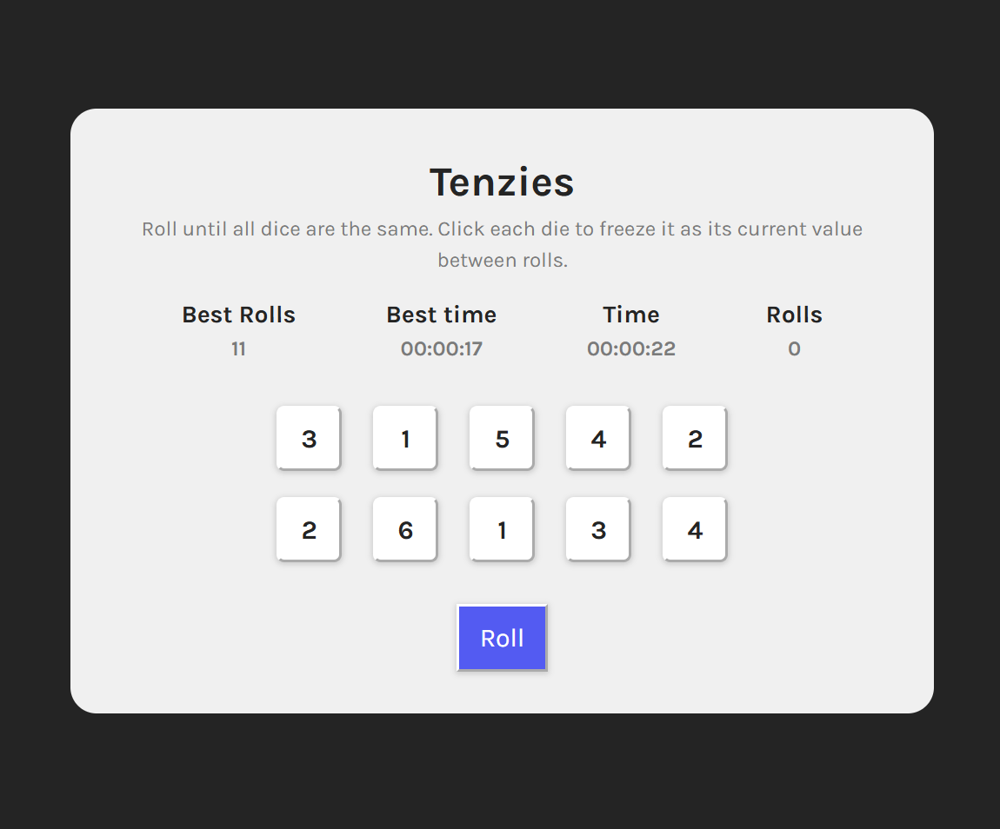
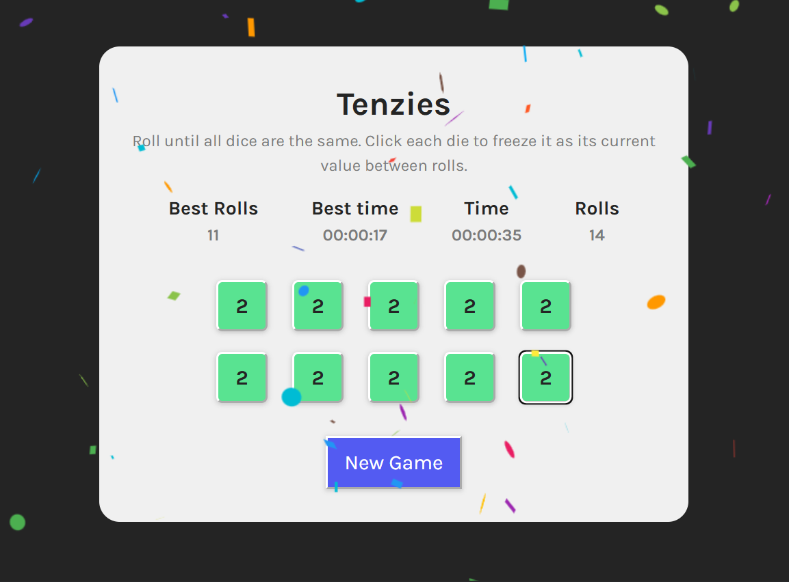

# 10rollzies Game – Built with React

A fun dice-rolling game where the goal is to get all dice to show the same value. Freeze the dice you want to keep and roll the rest until you match them all.

Built as part of a React learning journey — this project uses modern React concepts such as `useState`, `useEffect`, `useRef`, and `localStorage`.

## Features

- Win by holding dice until all values match
- Timer that starts on game load and stops on win
- Roll counter to track how many rolls it took to win
- Best time and roll count saved using `localStorage`
- Confetti animation when you win
- Responsive layout and simple, clean UI

## What I Learned

- Managing React component state with `useState`
- Side effects and timers using `useEffect`
- Persistent mutable values with `useRef`
- Handling conditional rendering and state-based UI logic
- Working with `localStorage` for persisting data across sessions
- Component composition and prop management

## Tech Stack

- React (Functional components + hooks)
- Vite (Development bundler)
- nanoid (Unique ID generation for dice)
- react-confetti (Win animation)
- CSS Modules (Simple global styling)

## Screenshots



### 🏆 Winning State with Confetti



## Getting Started

### Clone the repo

```bash
git clone https://github.com/tiagocostarebelo/tcr-tenzies-game.git
cd tcr-tenzies-game
```

### Install dependencies

```bash
npm install
```

### Start the Dev server

```bash
npm run dev
```

## How to Play

1. Click the Roll button to roll all dice.
2. Click on individual dice to "hold" their value.
3. Keep rolling until all dice show the same number.
4. Your time and roll count are tracked — try to beat your best score!

## To-do / Future Enchancements

- Add difficulty levels (e.g., 6 vs 10 dice)
- Add leaderboard or saved history

## License

MIT - Feel free to use or adapt the code for your own projects.